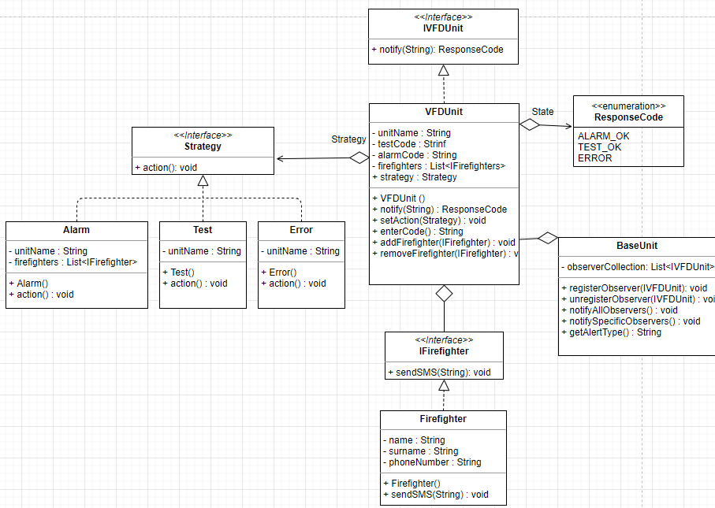

# Firefighter alarm simulation
Application created to model the alarming process of firefighters units. The master alarm device can alarm or send a system test command to one or more units. For each type of command, firefighters units need to enter unique code to accept command. If the message was an alarm, a simulation takes place: turning on the siren, arming the terminal and sending text messages to firefighters.

## Table of contents
* [Technologies](#technologies)
* [Run application](#how-to-run)
* [Features](#features)
* [Design patterns](#used-design-patterns)
* [UML Diagram](#uml-diagram)

## Technologies
Java 15

## How to run
```
$ cd Main
$ javac Main.java
$ java Main
```

## Used design patterns:
- **Observer** : Allows to alert other objects about changing the state. In the application it was used to send command to units, and to simulate sending text message to firefighters
- **Strategy** : It maps the operation of the unit's system after receiving a notification and selecting the appropriate action depending on the type of notification.
- **State** : It allows the object to execute the appropriate method depending on the internal state of the object.

## UML diagram
